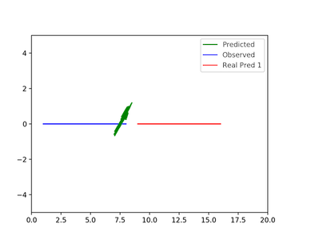

# Social GAN: Analyzing Adversarial Architecture 

This is the code for the paper

**<a href="https://transp-or.epfl.ch/heart/2019/abstracts/hEART_2019_paper_148.pdf">Adversarial Loss for Human Trajectory Prediction</a>**
<br>
<a href="https://people.epfl.ch/parth.kothari">Parth Kothari</a>,
<a href="https://people.epfl.ch/alexandre.alahi">Alexandre Alahi</a>
<br>
Presented at [hEART 2019](http://heart2019.bme.hu)

Autonomous vehicles need to accurately forecast future human trajectories in order to navigate safely and gain human trust. The current best performing approach Social GAN (SGAN) is based on Generative Adversarial Network (GAN) taking advantage of the success of Recurrent Neural Network (RNN) models in sequence prediction tasks. A crucial architectural difference of SGAN in comparison to Social LSTM is the incorporation of the GAN framework. We highlight an unexpected pitfall in this adversarial architecture via controlled experiments. Furthermore, we prove the efficacy of our proposed modification on synthetic data and real world datasets, thereby indicating room for improvement on state-of-the-art.

Below we show the example of predictions made by SGAN (left) and our model (right) in a simple controlled experiment. 
<div align='center'>
</img>
</img>
</div>

If you find this code useful in your research then please cite
```
@inproceedings{KothariAdversarialLF,
  title={Adversarial Loss for Human Trajectory Prediction},
  author={Parth Kothari and Alexandre Alahi},
  booktitle={hEART 2019: 8th Symposium of the European Association for Research in Transportation},
  number={CONF},
  year={2019}
}
```

## Model
Social GAN consists of three key components: Generator (G), Pooling Module (PM) and Discriminator (D). G and PM are responsible for outputting predicted future trajectories based on the input observed trajectories. D inputs the entire sequence comprising both input trajectory and future prediction and classifies them as “real/fake”. We show that the proposed D is unable to provide gradients to G for effective learning, thereby indicating room for improvement on state-of-the-art. We propose a possible architectural change wherein a feedforward D is able to provide effective gradients for learning.

## General Setup

Please refer to [Social GAN](https://github.com/agrimgupta92/sgan)

## Controlled Setup

```bash
python controlled_setup/controlled_data.py       # Create data
sh controlled_setup/copy.sh single_traj          # Transfer data
```

## Running Models

For Social GAN, the default parameters are obtained using the following command

```bash
python  python scripts/print_args.py --checkpoint models/sgan-models/eth_12_model.pt
```

## Training new models

```bash
python -m scripts.train --plot 1 --disc_type 'rnn' --plot 1 --min_ped 0 ## Default Social GAN
python -m scripts.train --plot 1 --disc_type 'ff' --encoder_h_dim_g 16 --decoder_h_dim_g 16 --plot 1 --min_ped 0 ## Feedfoward Discriminator
```
